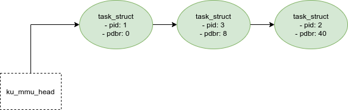

# ku-mmu
Memory mangement unit, user-level implementation

## Basic data structure
### PCB list


### Memory freelist


### Mapping list


## Build and run
```shellscript
$ sh run.sh
```

# License
- MIT